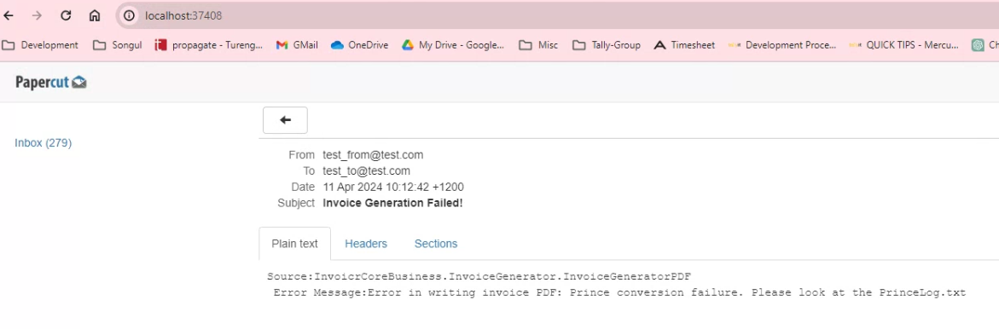

# CoolInvoice

## Structure

Following the Clean Structure logic, the InvoıcrApp project was divided into the following projects:

* **InvoicrInfrastructure**: Generic EF DB configuration+Emailing + JSON2PDF + Logger (SeriLog) + JSON Seriazlier
* **InvoicrCoreModels**: The core classes (InvoiceEvent, Invoice, InvoiceLineItem, etc.) + some DTO classes (InvoiceEventDto, InvoiceDto, InvoiceLineItemDto) + DirectoryExtensions and StringExtensions
* **InvoicrCoreBusiness**: This includes interfaces and their implementations (e.g. IInvoiceWorker, InvoiceWorker, IInvoiceGenerator, InvoiceGeneratorTextFile, InvoiceGeneratorPDF, IInvoiceProvider, InvoiceProviderWeb, InvoiceProviderMemory) + HTTPService + AutoMap mappings + Specifications for EF querying + Utility Classes (AppConfig, FileUtility, InvoiceAPI utility) + InvoiceGenerationFailedNotification (a Mediatr INotification implementation)
* **InvoicrApp**: Now it has only DI related code in Program.cs + InvoiceGenerationFailedNotificationHandler + AppSettings + template.hbs (PDF Invoice Template)

The project now works completely with different/optional service implementations with the help of Dependency Injection pattern. .Net Core DI container was used for InvoicrApp whereas Autofac was used for Tests project.

The classes in the Test project now uses fixture classes (InvoiceHandlerTextInvoiceTestFixture, InvoiceWorkerTextInvoiceTestFixtureException and InvoiceWorkerPDFInvoiceTestFixture) that provides services in the Autofac DI container.

## Features

* Invoices are created in daily folders

  
* Detailed Logging (both Console and file logging) with SeriLog

  
* Storing global parameters in App.config.
* The option that allows to store and retrieve the latest processed invoice event ID in the database (see IInvoicePersistance, InvoicePersistanceTextFile, InvoicePersistanceDB).

  
* Invoice generation as PDF files (see IInvoiceGenerator, InvoiceGeneratorTextFile, InvoiceGeneratorPDF). Used HandleBar to convert JSON to HTML and Prince to convert HTML to PDF.

  
* Added EventId, Event Type, Invoice Line Count and Invoice Total into the both text anf PDF invoices.
* Added the optional Invoice Event Provider from memory (see IInvoiceEventProvider, InvoiceEventProviderWeb, InvoiceEventProviderMemory)
* The process was made cancellable by entering a key on the console.

  
* When the invoice generation fails, the Invoicr App sends an email stating that there was a problem for generating such-such invoice.
* InvoiceHandlerTextInvoiceTest class uses XUnitLogger so we can see the logs on the Test Explorer.

  
* Two new test classes: ShouldPDFCountMatch and Invoice Generation Exception Test (event handling and Mediatr notification test)

## External Libraries/Tools Used

* **EF Core** as ORM (SQLServer)
* **Autofac** as DI container
* **AutoMapper** for mapping
* **Mediatr** as in-app event handling tool
* **SeriLog** for logging
* **Handlebar** as template engine
* **Prince** as HTML2PDF tool
* **Ardalis Specification** for specification pattern
* **XUnitLogger**
* **Papercut** to see the localhost emails

## How to

* **DB**: To create/update the DB, check the connection string in the apsettings.json under InvoicrApp project. Add a migration under the Infrastructure project. AppSettings.json (with a default connection string) should be present in the folder where Infrastructure library is compiled.
* **Papercut**: You can run Papercut from Docker. Run the following command: *docker run --name=papercut -p 25:25 -p 37408:37408 jijiechen/papercut:latest*. And then access Papercut mailbox from the following URL: [localhost:37408](http://localhost:37408/)
* **Mock Web API**
Use the following commands to start the mock API on http://localhost:8200. This is required for the Invoicr app to run.
**cd mock** and then to run the mock **dotnet Invoicr.EventFeed.dll**.
